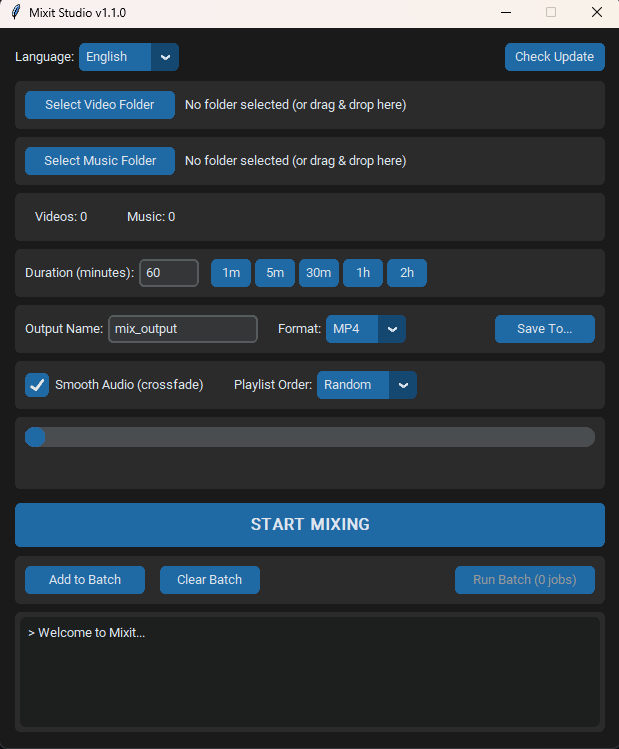

# 🎬 Mixit - Ultra Fast Video Mixer


🌐 **Bahasa:** [English](README.md) | Bahasa Indonesia

Gabungkan video dan musik jadi satu mix video dalam hitungan detik! Cocok untuk kompilasi video, background streaming, atau konten YouTube.

**⚡ 1 jam video = ~5-30 detik proses** (tanpa rendering, PC kentang friendly!)



---

## 📑 Daftar Isi

- [Download & Install](#-download--install)
- [Build jadi App Windows](#-build-jadi-app-windows-exe)
- [Cara Pakai](#-cara-pakai)
- [Fitur](#-fitur)
- [Tips](#-tips)
- [Author](#-author)
- [Lisensi](#-lisensi)

---

## 📥 Download & Install

### Cara 1: Download Release (Recommended)

1. Buka halaman [Releases](../../releases)
2. Download `Mixit.zip` dari release terbaru
3. Extract zip
4. Jalankan `Mixit.exe`

> ⚠️ Pastikan folder `bin/` (berisi `ffmpeg.exe` & `ffprobe.exe`) ada di sebelah `Mixit.exe`

---

### Cara 2: Jalankan dari Source Code

**Step 1: Download Project**
```bash
git clone https://github.com/sondero-ai/mixit.git
cd mixit
```
Atau klik tombol hijau **Code** → **Download ZIP** → Extract

**Step 2: Install Python**
- Download dari [python.org](https://www.python.org/downloads/) (versi 3.10+)
- Saat install, centang ✅ **Add Python to PATH**

**Step 3: Install Dependencies**
```bash
pip install -r requirements.txt
```

**Step 4: Download FFmpeg**
- Download dari [gyan.dev/ffmpeg](https://www.gyan.dev/ffmpeg/builds/) (pilih `ffmpeg-release-essentials.zip`)
- Extract, copy `ffmpeg.exe` dan `ffprobe.exe` ke folder `bin/`

**Step 5: Jalankan**
```bash
python main.py
```

---

## 🔨 Build jadi App Windows (.exe)

Ingin jadikan standalone app tanpa perlu Python?

```bash
pip install pyinstaller
pyinstaller Mixit.spec
```

Hasil ada di folder `dist/Mixit.exe`. Copy juga folder `bin/` ke sebelah exe.

---

## 🎯 Cara Pakai

1. **Pilih folder video** - Klik tombol atau drag & drop folder
2. **Pilih folder musik** - Klik tombol atau drag & drop folder  
3. **Atur durasi** - Ketik manual atau klik preset (1m, 5m, 30m, 1h, 2h)
4. **Klik START MIXING** - Tunggu sebentar, selesai!

### Opsi Tambahan
| Opsi | Fungsi |
|------|--------|
| **Smooth Audio** | Crossfade antar lagu (lebih halus) |
| **Playlist Order** | Urutan musik: Random / A-Z / Manual |
| **Format** | Output: MP4 atau MKV |
| **Batch Mode** | Buat banyak mix sekaligus |

---

## ✨ Fitur

- ⚡ Ultra cepat (stream copy, tanpa rendering)
- 🎲 Video & musik diacak otomatis
- 🔄 Auto-loop sampai durasi tercapai
- 🎵 Multi-track musik dengan crossfade
- 🎬 Lagu terakhir selesai natural
- 📁 Drag & drop support
- 🌐 English & Bahasa Indonesia
- 📦 Batch processing

---

## ⚠️ Tips

- **Format video sama** = hasil lebih baik (misal semua MP4 1080p)
- **Format audio sama** = mode Fast Audio bisa dipakai (misal semua MP3)
- **Durasi output** = bisa sedikit lebih panjang (lagu terakhir selesai dulu)

---

## 👤 Author

**Sondero AI**

- 🌐 Portfolio: [sondero.xyz](https://sondero.xyz)
- 📰 AI News & Tools: [cogitodaily.com](https://cogitodaily.com)
- 💻 GitHub: [@sondero-ai](https://github.com/sondero-ai)

---

## 📄 Lisensi

**Personal Use Only** - Software ini gratis untuk penggunaan pribadi, non-komersial. Dilarang menjual atau mendistribusikan ulang.

---

Made with ❤️ using Python & FFmpeg
